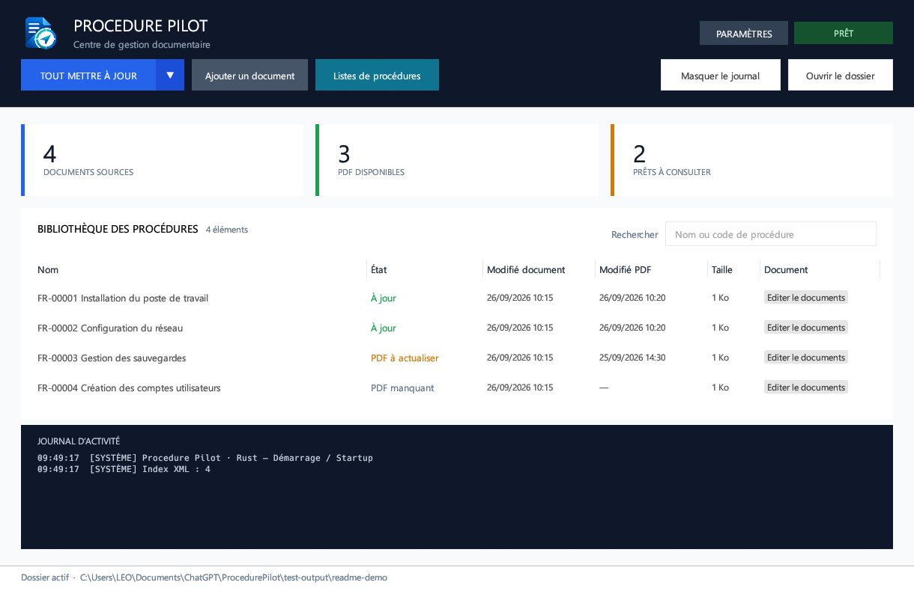

# Procedure Pilot 2.0

Application Windows portable de gestion documentaire : consultation des procédures, conversion PDF, renommage, archivage et listes ordonnées. La version 2.0 est écrite en Rust et conserve la compatibilité avec les données XML de la version 1.0. Aucun environnement .NET ni serveur web n’est nécessaire.



*Aperçu de l’application avec des procédures de démonstration.*

## Téléchargement

[Télécharger Procedure Pilot 2.0.0 pour Windows x64](https://github.com/TheDeadWave-FR/ProcedurePilot/releases/download/v2.0.0/ProcedurePilot-rust-windows-x64-v2.0.0.zip) · [Toutes les versions](https://github.com/TheDeadWave-FR/ProcedurePilot/releases)

Le ZIP contient `ProcedurePilot.exe`, ce guide et la licence LLVM. Il est non chiffré et sans mot de passe. Fermer Procedure Pilot sur tous les postes avant de remplacer l’exécutable ; conserver les dossiers `Documents`, `PDFs`, `Archive` et `Data` de votre espace de travail.

L’interface est reconstruite avec egui/eframe en reprenant la disposition, la palette et les libellés de la version WinForms : bandeau bleu nuit, trois compteurs, barre d’actions, bibliothèque avec recherche et menu contextuel, journal, paramètres et listes ordonnées. Les contrôles sont redessinés par egui ; ce ne sont pas les anciens contrôles WinForms.

L’habillage reprend la capture de référence : compteurs blancs avec accents verticaux, bouton de mise à jour et menu bleu joints, recherche encadrée, séparateurs discrets et journal proportionnel à la hauteur de la fenêtre. Le journal affiche les heures locales ; les fichiers de logs conservent leurs horodatages complets. Une indication accompagne les bibliothèques vides et les recherches sans résultat.

Le bouton « Masquer le journal » / « Afficher le journal », à côté de « Ouvrir le dossier », permet de replier le journal pour agrandir la bibliothèque. Les événements continuent à être enregistrés lorsqu’il est masqué. Le journal est visible au démarrage.

La bibliothèque affiche séparément « Modifié document » et « Modifié PDF », avec les dates de dernière modification des fichiers en heure locale. Un tiret apparaît lorsque la date du PDF est indisponible ou que le PDF est absent.

Les actions de mise à jour, ajout, listes, journal et ouverture du dossier sont regroupées dans le bandeau supérieur, entre le logo et les paramètres. Sur une fenêtre de moins de 1560 pixels logiques de large, elles occupent une seconde ligne du bandeau pour préserver la lisibilité des libellés.

Le logo fourni apparaît dans l’en-tête et comme icône de la fenêtre et de l’EXE Windows. Les images et les différentes résolutions de l’icône sont intégrées à l’exécutable ; le dossier `assets` est nécessaire uniquement pour recompiler les sources.

## Utilisation

Décompresser `dist/ProcedurePilot-rust-windows-x64-v2.0.0.zip`, puis lancer `ProcedurePilot.exe`. Aucune `libunwind.dll` n’est nécessaire : cette bibliothèque est intégrée à l’exécutable. Au premier lancement, un assistant propose un emplacement pour `Documents`, `PDFs`, `Archive` et `Data`. Choisir un dossier parent, ou sélectionner séparément des dossiers existants, puis valider avec « Créer et continuer » / « Continuer ». Quitter cet écran ne crée aucun dossier. On peut aussi choisir un espace de travail explicitement :

```powershell
.\ProcedurePilot.exe --root 'D:\Procedure'
```

Fonctions disponibles :

- Recherche, sélection multiple avec Ctrl, ouverture du PDF par simple clic dans les colonnes Nom, État, Modifié document, Modifié PDF ou Taille. Le bouton « Editer le documents », après la taille, ouvre le fichier source. Ctrl+clic conserve la sélection multiple sans ouvrir de fichier. L’ouverture du document et l’archivage restent disponibles par clic droit.
- Clic droit sur une ligne → « Renommer la procédure… » : saisir le nouveau nom sans extension, puis « Renommer ». Le document et le PDF existant prennent le même nom ; leurs extensions, contenus et dates sont conservés. Les listes et les index sont actualisés. Les noms invalides, les collisions de noms ou de codes sont refusés ; un échec de renommage du PDF ou d’enregistrement des listes déclenche la restauration des noms précédents.
- L’attribution automatique des codes renomme également le PDF existant et conserve sa date. En cas de collision dans les archives, le même suffixe est appliqué au document et à son PDF. Un échec de copie ou de suppression pendant l’archivage déclenche la restauration des fichiers de toute la sélection ; si cette restauration échoue, les copies nécessaires sont conservées et leurs chemins signalés.
- Ajout de plusieurs documents et glisser-déposer ; mise à jour complète après import.
- Bouton **TOUT METTRE À JOUR**, menu **Mise à jour des tags**, **Convertir en PDF**, **Actualiser les index XML**.
- Numérotation `<PRÉFIXE>-00001`, validation des doublons, conservation des codes existants, mise à jour des références des listes après renommage.
- Création, modification, suppression et réorganisation des listes ; ouverture des procédures depuis une liste.
- Paramètres de dossiers, préfixe et langue français/anglais par utilisateur Windows.
- Synchronisation automatique après stabilisation des fichiers pendant 1,5 seconde, avec vérification périodique toutes les 750 ms. La bibliothèque et les listes suivent les modifications des autres postes.
- Index récursif des archives, PDF manquants/périmés, suppression des PDF orphelins pendant la synchronisation complète.
- Journal persistant avec date UTC et provenance `SYSTEM` ou `USER DOMAINE\Utilisateur`.

Les chemins Documents/PDF/Archive/Data doivent être absolus, distincts et non imbriqués. Les archives peuvent être sur un autre disque. Un fichier existant n’est jamais écrasé lors de l’import ; une collision d’archivage crée un nom distinct.

Si un dossier devient introuvable au démarrage ou pendant l’utilisation, les traitements sont suspendus. L’écran « Vérifier les dossiers » permet de cocher « Recréer ici », de « Resélectionner… » un dossier ou de réessayer la détection après reconnexion. Les créations attendent la confirmation finale. Recréer un dossier ne restaure pas ses fichiers ; sélectionner un emplacement ne déplace pas les fichiers. La reprise après réparation actualise les index sans supprimer les PDF ni retirer les références des listes.

Les fichiers `.procedurepilot-data-folder` et `.procedurepilot-recovery.xml` sont créés dans le dossier `Data` de l’espace de lancement. Le premier mémorise le dossier de données ; le second conserve les chemins, le préfixe et la langue partagée pour réparer la configuration. Les anciennes copies à la racine sont reconnues puis déplacées dans `Data` au démarrage d’un espace configuré. Ces fichiers ne constituent pas une sauvegarde des documents ni des listes. Si le dossier `Data` contenant ces fichiers disparaît, cette copie de récupération disparaît également. Les anciens fichiers de localisation restent reconnus.

## Compatibilité des données

Les schémas XML de la version C# sont conservés : `ApplicationSettings` version 5, `DocumentIndex` version 1, `ArchiveIndex` version 1 et `ProcedureLists` version 1. Les dates sont en UTC et les références de fichiers comprennent chemins relatifs et URI. Le fichier `%LOCALAPPDATA%\ProcedurePilot\UserSettings.xml` reste compatible.

Les anciens fichiers `ProcedurePilot.settings.xml`, les racines `ProcedurePilotSettings`, `SettingsFolderPath` et les fichiers de localisation sont lus. L’assistant réutilise les dossiers historiques `Procedures_Modifiables`, `Procedures_PDF`, `_ARCHIVE` et `Settings` lorsqu’ils existent. Un dossier de données historique explicitement configuré reste utilisé : il n’est pas déplacé pendant qu’un verrou multi-utilisateur y est ouvert.

Les XML sont écrits par remplacement atomique. Un fichier de paramètres illisible provoque une erreur et reste intact. Une déconnexion NAS ouvre la réparation des dossiers ; elle n’est pas assimilée à un dossier de documents vide.

## Conversion PDF

Formats reconnus : DOCX, DOC, DOCM, DOTX, DOT, DOTM, ODT, OTT, FODT, RTF, SXW, STW. Les fichiers temporaires Office `~$…` sont ignorés.

Word (y compris Office 365) est utilisé en priorité, via son export PDF natif piloté par COM depuis Rust. Cela conserve la composition Word : styles, tableaux, couleurs automatiques, en-têtes, pieds de page et pagination. Le document est ouvert en lecture seule, les macros sont désactivées et la source n’est pas enregistrée.

En cas d’échec, LibreOffice/OpenOffice est essayé s’il est installé. Pour DOCX/DOCM/DOTX/DOTM, le rendu HTML local imprimé par Edge/Chrome/Chromium reste un dernier recours. Les anciens formats nécessitent un moteur bureautique. Chaque tentative est limitée à deux minutes. Un PDF existant est remplacé seulement après validation du nouveau fichier et vérification que la source n’a pas changé. Les fichiers partiels des moteurs en échec sont écartés.

Le secours HTML n’est pas un moteur de composition Word complet : objets OLE, graphiques, champs complexes, mises en page à plusieurs sections et certaines polices/images peuvent différer. Pour réparer des PDF déjà générés, utiliser le menu **Convertir en PDF** : cette action régénère tous les PDF, même ceux indiqués à jour. La synchronisation automatique et **TOUT METTRE À JOUR** continuent à traiter uniquement les PDF manquants ou périmés.

En ligne de commande : `ProcedurePilot.exe --root "D:\Procedures" --convert-pdfs --report "D:\rapport.txt"`.

## NAS et plusieurs utilisateurs

Plusieurs utilisateurs peuvent ouvrir Procedure Pilot en même temps depuis le même partage NAS. Configurer les mêmes chemins UNC (par exemple `\\NAS\Partage\ProcedurePilot\Data`) et utiliser la même version sur tous les postes, avec les droits de lecture, création, modification, renommage et suppression dans les dossiers de travail. Les chemins locaux `C:\…` d’un poste ne désignent pas le NAS pour les autres utilisateurs.

`.procedurepilot-data-folder` contient le chemin des données : ce n’est pas un verrou. Les verrous Windows/SMB `.procedurepilot-write.lock` et `.procedurepilot-log.lock` sérialisent les écritures. Ils sont détenus pendant l’opération concernée, puis libérés ; ils ne réservent pas l’application pendant toute la session. Une mise à jour comprenant des conversions PDF peut toutefois garder le verrou pendant tout le traitement. Les autres fenêtres restent utilisables pour consulter les éléments déjà affichés ; l’actualisation attend la fin de l’écriture. Une action manuelle concurrente peut expirer et doit alors être relancée.

Les fichiers `.lock` vides peuvent rester sur le disque : leur présence seule ne signifie pas qu’un utilisateur bloque les données. Ne pas les supprimer pendant l’utilisation. `.procedurepilot-change` est un marqueur interne de modification. Au démarrage et pendant la surveillance, un verrou occupé entraîne une nouvelle tentative automatique. Les écritures vérifient les paramètres partagés après acquisition du verrou pour refuser une opération fondée sur une ancienne configuration.

Une modification de liste compare la version éditée à celle actuellement enregistrée avant de la remplacer. Un conflit affiche une erreur ; les modifications d’une autre liste sont conservées. Les opérations lourdes sont exécutées sur un thread de travail pour garder l’interface réactive.

## Compilation

Configuration locale : Windows x64, Rust 1.98.1, cible `x86_64-pc-windows-gnullvm` et LLVM-MinGW UCRT. Une chaîne Rust MSVC standard peut aussi être utilisée avec les outils de compilation Visual Studio appropriés. Le premier build télécharge les dépendances verrouillées dans `Cargo.lock`.

```powershell
.\build.ps1
```

Ce script exécute les tests, compile en mode release et crée l’exécutable portable et son ZIP dans `dist`. Si `.tools/cargo` et `.tools/rustup` existent, il utilise cette chaîne locale sans modifier le PATH Windows permanent.

Lorsqu’un dossier `.tools/llvm-mingw-*-ucrt-x86_64` est présent, le script choisit la cible Rust LLVM correspondante (à installer avec `rustup target add x86_64-pc-windows-gnullvm`). La configuration `.cargo/config.toml` impose la liaison statique de libunwind avec `-C target-feature=+crt-static` ; le script vérifie l’absence d’import de `libunwind.dll` avant de produire le ZIP. Les DLL système de Windows restent utilisées. Le compilateur et les dépendances de développement ne sont pas inclus dans le ZIP portable.

Commandes de développement :

```powershell
cargo test --locked
cargo clippy --all-targets --locked -- -D warnings
cargo fmt --check
```

## Commandes de diagnostic

```powershell
.\ProcedurePilot.exe --root 'D:\Procedure' --self-test --report 'D:\diagnostic.txt'
.\ProcedurePilot.exe --root 'D:\Procedure' --index --report 'D:\index-result.txt'
.\ProcedurePilot.exe --root 'D:\Procedure' --tags
.\ProcedurePilot.exe --root 'D:\Procedure' --sync
.\ProcedurePilot.exe --convert-local 'D:\document.docx' --output 'D:\document.pdf'
.\ProcedurePilot.exe --render-html 'D:\document.docx' --output 'D:\document.html'
```

`--test-xml-index` et `--test-portable-index` sont conservés comme alias de `--index`. `--screenshot chemin.png` enregistre une capture interne de l’interface puis ferme l’application ; à utiliser avec un espace de test via `--root`.

Les commandes non interactives `--self-test`, `--index`, `--tags` et `--sync` conservent l’initialisation automatique de leur espace et la migration des anciens noms par défaut. L’assistant et la confirmation de recréation concernent le lancement graphique normal, y compris avec `--root`.

Les tests de Rust couvrent notamment les XML historiques, les caractères accentués, les tags, les conflits de listes, les verrous exclusifs, les collisions d’import et d’archivage, les PDF périmés/orphelins et l’indisponibilité d’un dossier. Une validation sur un NAS réel reste nécessaire avant un déploiement partagé.
